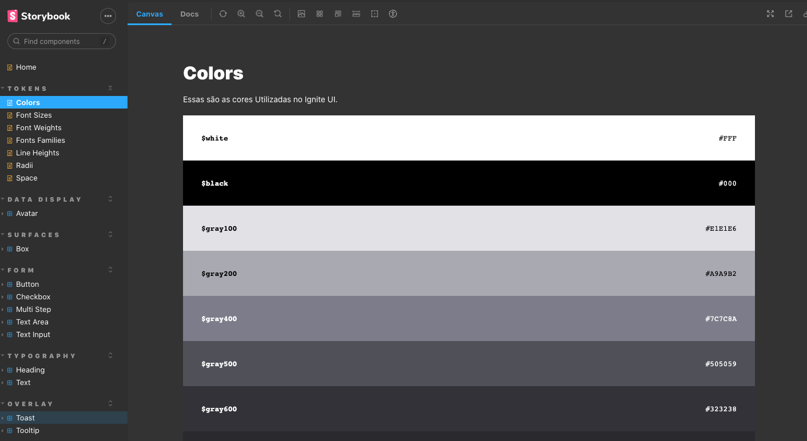

<h1 align='center'>
    Ignite Design System
</h1>

   

  

## 🚀 Technologies

This project was developed with the following technologies:

- [React](https://reactjs.org/)
- [Storybook](https://storybook.js.org/)
- [TypeScript](https://www.typescriptlang.org/)
- [Stitches](https://stitches.dev/)
- [Radix UI](https://www.radix-ui.com/)
- [Turborepo](https://turbo.build/)
- [Phosphor Icon](https://phosphoricons.com/)

---

Made with ♥ by Gustavo Nobrega